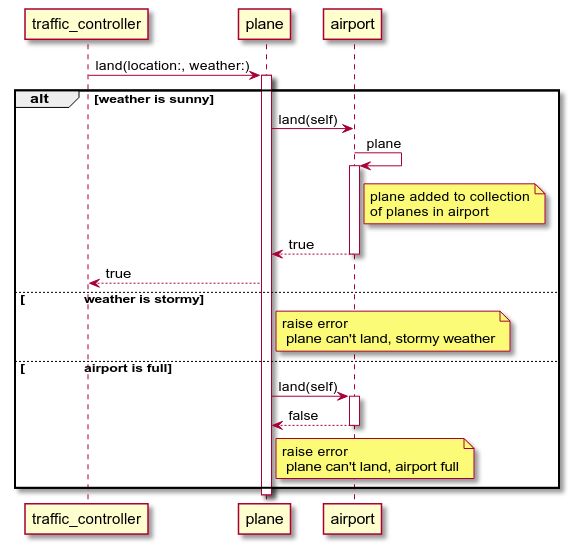
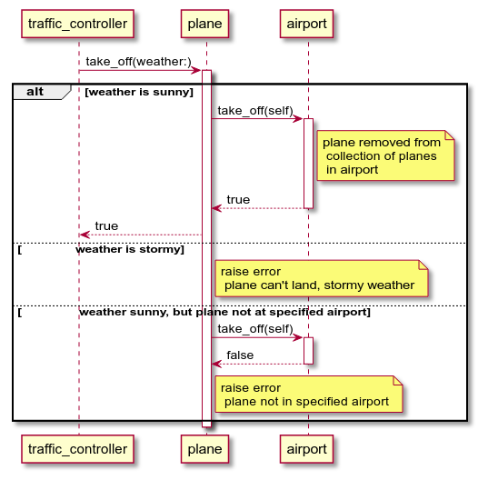
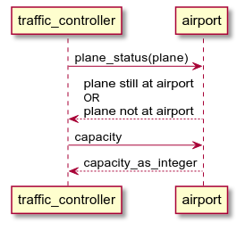

# Airport Challenge - Solution

## About

This is my solution to the first weekend challenge. The aim of this exercise was to build an application from the ground up using BDD based on given user stories.

This being my first real test at domain modeling, I found it really difficult to decide on an appropriate domain model. Therefore, I decided to build draw sequence diagrams first to have another intermediate, _visual_ reference point between the user stories and the unit tests.

I have shown a practical demonstration of how to use the application using irb in the [application demonstration](#application-demonstration) section. My approach to building the application is shown [here](#my-process-of-building-the-application). The diagrams are shown [here](#diagrams).

## Application Demonstration

```
$ irb --simple-prompt
>> # setup
=> nil
>> require "./lib/plane"
=> true
>> require "./lib/airport"
=> true
>> plane = Plane.new
=> #<Plane:0x000000000116c640>
>> airport = Airport.new
=> #<Airport:0x0000000001175a10 @planes=[], @capacity=100>
>> # user story 1: land at airport
=> nil
>> plane.land(airport: airport, weather: :sunny)
=> true
>> # user story 2: take-off from airport
=> nil
>> plane.take_off(airport: airport, weather: :sunny)
=> true
>> airport.plane_status(plane)
=> "plane not at airport"
>> # user story 3: prevent take-off when stormy
=> nil
>> plane.land(airport: airport, weather: :sunny)
=> true
>> plane.take_off(airport: airport, weather: :stormy)
Traceback (most recent call last):
        4: from /home/rxr/.rvm/rubies/ruby-2.5.0/bin/irb:11:in `<main>'
        3: from (irb):13
        2: from /home/rxr/[...]/airport_challenge/lib/plane.rb:10:in `take_off'
        1: from /home/rxr/[...]/airport_challenge/lib/plane.rb:37:in `takeoff_storm_error'
RuntimeError (plane can't take off, stormy weather)
>> # user story 4: prevent landing when stormy
=> nil
>> another_plane = Plane.new
=> #<Plane:0x0000000001204558>
>> another_plane.land(airport: airport, weather: :stormy)
Traceback (most recent call last):
        4: from /home/rxr/.rvm/rubies/ruby-2.5.0/bin/irb:11:in `<main>'
        3: from (irb):16
        2: from /home/rxr/[...]/airport_challenge/lib/plane.rb:5:in `land'
        1: from /home/rxr/[...]/airport_challenge/lib/plane.rb:25:in `land_storm_error'
RuntimeError (plane can't land, stormy weather)
>> # user story 5: prevent landing when airport is full
=> nil
>> another_airport = Airport.new
=> #<Airport:0x000000000117c4a0 @planes=[], @capacity=100>
>> another_airport.capacity
=> 100
>> 100.times { plane.land(airport: another_airport, weather: :sunny) }
=> 100
>> plane.land(airport: another_airport, weather: :sunny)
Traceback (most recent call last):
        5: from /home/rxr/.rvm/rubies/ruby-2.5.0/bin/irb:11:in `<main>'
        4: from (irb):24
        3: from /home/rxr/[...]/airport_challenge/lib/plane.rb:6:in `land'
        2: from /home/rxr/[...]/airport_challenge/lib/plane.rb:17:in `attempt_landing'
        1: from /home/rxr/[...]/airport_challenge/lib/plane.rb:29:in `airport_full_error'
RuntimeError (plane can't land, airport full)
>> # user story 6: capacities can be overridden on initialization
=> nil
>> airport.capacity
=> 100
>> yet_another_airport = Airport.new(200)
=> #<Airport:0x0000000001272aa8 @planes=[], @capacity=200>
>> yet_another_airport.capacity
=> 200
```

## My Process of Building The Application

* built sequence diagrams based on user stories
* BDD cycle for unit tests
  * wrote a unit test
  * changed the class so that it passed
  * refactored
* wrote integrity test
* reread the user stories and made adjustments to tests, then code

## Diagrams

I have drawn the diagrams using plantUML. The source code of these diagrams is available in the same directory as this readme.

**Landing:**



**Takeoff:**



**Other Airport Features:**

