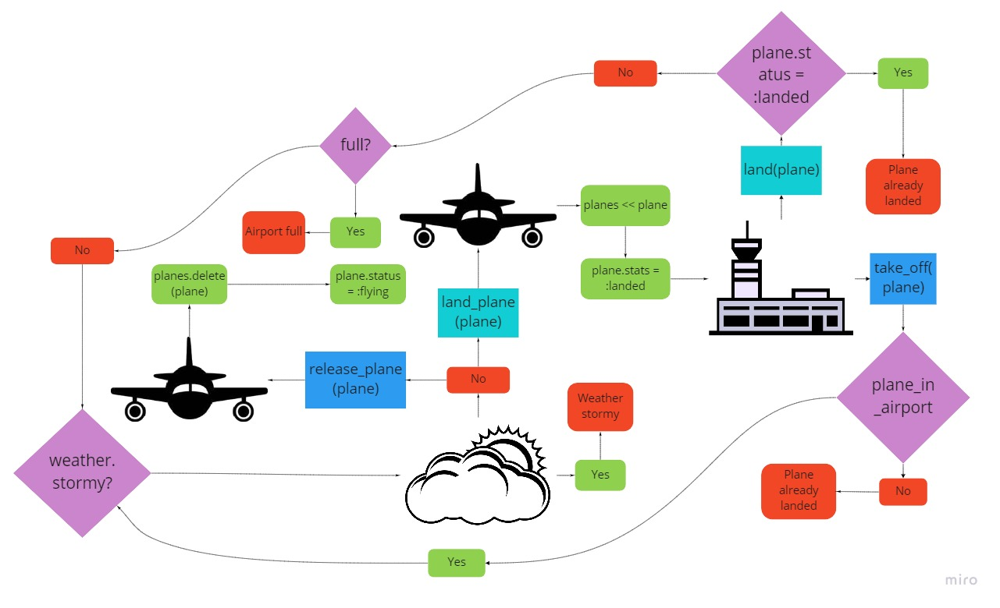

Airport Challenge
=================


How I approached the challenge
-----------------------------

1. First I built a basic domain model.

Objects | Messages | Private Messages
-------|--------|----------
Airport | land <br/> take_off <br/> capacity | full? <br/> landing_safe? <br/> can_take_off?
Plane   | status
Weather | stormy?

I decided to send the #land and #take_off messages from within the Airport class and use the Plane class as the parameter so that I could easily insert the Plane class instances into an array within the Airport class, as this would reflect real life, where planes would be placed within airports and not the other way around.


2. I constructed a diagram.

This diagram describes the flow of the program, starting from the airport and then making a request to either land or take off a plane.

 

3. I wrote feature and unit tests for the program.
4. I wrote the simplest program possible to pass the tests.
5. I refactored my code.
6. I returned back to step 3
7. I spent some time focused on further refactoring my code and finished this README file.

How to use my program via irb
--------------------------
### Land and take off plane
1. Require airport.rb
2. Create airport
3. Create plane
4. Land plane
5. Shows plane in airport with status 'landed'
6. Take off plane
7. Shows airport is now missing plane
8. Shows plane status is now 'flying'
```
2.6.5 :001 > require './lib/airport.rb'
 => true 
2.6.5 :002 > airport = Airport.new
 => #<Airport:0x00007fd0da884cc8 @planes=[], @capacity=50, @weather=#<Weather:0x00007fd0da884ae8>> 
2.6.5 :003 > plane = Plane.new
 => #<Plane:0x00007fd0db066900> 
2.6.5 :004 > airport.land(plane)
 => :landed 
2.6.5 :005 > airport
 => #<Airport:0x00007fd0da884cc8 @planes=[#<Plane:0x00007fd0db066900 @status=:landed>], @capacity=50, @weather=#<Weather:0x00007fd0da884ae8>> 
2.6.5 :006 > airport.take_off(plane)
 => :flying 
2.6.5 :007 > airport
 => #<Airport:0x00007fd0da884cc8 @planes=[], @capacity=50, @weather=#<Weather:0x00007fd0da884ae8>> 
2.6.5 :008 > plane
 => #<Plane:0x00007fd0db066900 @status=:flying> 
```
### Set airport capacity
1. Require airport.rb
2. Create airport
3. Set capacity
4. Shows airport with new capacity
```
2.6.5 :001 > require './lib/airport.rb'
 => true 
2.6.5 :002 > airport = Airport.new
 => #<Airport:0x00007fb064147e60 @planes=[], @capacity=50, @weather=#<Weather:0x00007fb064147e10>> 
2.6.5 :003 > airport.capacity = 20
 => 20 
2.6.5 :004 > airport
 => #<Airport:0x00007fb064147e60 @planes=[], @capacity=20, @weather=#<Weather:0x00007fb064147e10>> 
```
Enjoy using my airport program! <br/>
Instructions to create your own are below.
<br/>
<br/>


--------------------------

```
        ______
        _\____\___
=  = ==(____MA____)
          \_____\___________________,-~~~~~~~`-.._
          /     o o o o o o o o o o o o o o o o  |\_
          `~-.__       __..----..__                  )
                `---~~\___________/------------`````
                =  ===(_________)

```
Instructions
---------

* Challenge time: rest of the day and weekend, until Monday 9am
* Feel free to use google, your notes, books, etc. but work on your own
* If you refer to the solution of another coach or student, please put a link to that in your README
* If you have a partial solution, **still check in a partial solution**
* You must submit a pull request to this repo with your code by 9am Monday morning

Steps
-------

1. Fork this repo, and clone to your local machine
2. Run the command `gem install bundle` (if you don't have bundle already)
3. When the installation completes, run `bundle`
4. Complete the following task:

Task
-----

We have a request from a client to write the software to control the flow of planes at an airport. The planes can land and take off provided that the weather is sunny. Occasionally it may be stormy, in which case no planes can land or take off.  Here are the user stories that we worked out in collaboration with the client:

```
As an air traffic controller 
So I can get passengers to a destination 
I want to instruct a plane to land at an airport

As an air traffic controller 
So I can get passengers on the way to their destination 
I want to instruct a plane to take off from an airport and confirm that it is no longer in the airport

As an air traffic controller 
To ensure safety 
I want to prevent landing when the airport is full 

As the system designer
So that the software can be used for many different airports
I would like a default airport capacity that can be overridden as appropriate

As an air traffic controller 
To ensure safety 
I want to prevent takeoff when weather is stormy 

As an air traffic controller 
To ensure safety 
I want to prevent landing when weather is stormy 
```

Your task is to test drive the creation of a set of classes/modules to satisfy all the above user stories. You will need to use a random number generator to set the weather (it is normally sunny but on rare occasions it may be stormy). In your tests, you'll need to use a stub to override random weather to ensure consistent test behaviour.

Your code should defend against [edge cases](http://programmers.stackexchange.com/questions/125587/what-are-the-difference-between-an-edge-case-a-corner-case-a-base-case-and-a-b) such as inconsistent states of the system ensuring that planes can only take off from airports they are in; planes that are already flying cannot take off and/or be in an airport; planes that are landed cannot land again and must be in an airport, etc.

For overriding random weather behaviour, please read the documentation to learn how to use test doubles: https://www.relishapp.com/rspec/rspec-mocks/docs . There’s an example of using a test double to test a die that’s relevant to testing random weather in the test.

Please create separate files for every class, module and test suite.

In code review we'll be hoping to see:

* All tests passing
* High [Test coverage](https://github.com/makersacademy/course/blob/master/pills/test_coverage.md) (>95% is good)
* The code is elegant: every class has a clear responsibility, methods are short etc. 

Reviewers will potentially be using this [code review rubric](docs/review.md).  Referring to this rubric in advance will make the challenge somewhat easier.  You should be the judge of how much challenge you want this weekend.

**BONUS**

* Write an RSpec **feature** test that lands and takes off a number of planes

Note that is a practice 'tech test' of the kinds that employers use to screen developer applicants.  More detailed submission requirements/guidelines are in [CONTRIBUTING.md](CONTRIBUTING.md)

Finally, don’t overcomplicate things. This task isn’t as hard as it may seem at first.

* **Submit a pull request early.**

* Finally, please submit a pull request before Monday at 9am with your solution or partial solution.  However much or little amount of code you wrote please please please submit a pull request before Monday at 9am.
