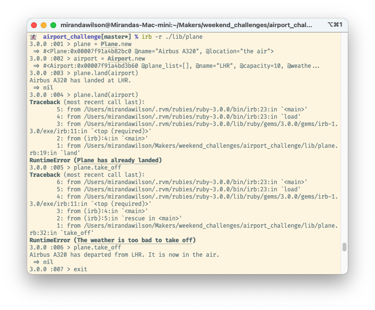

## Airport Challenge

```
        ______
        _\____\___
=  = ==(____MA____)
          \_____\___________________,-~~~~~~~`-.._
          /     o o o o o o o o o o o o o o o o  |\_
          `~-.__       __..----..__                  )
                `---~~\___________/------------`````
                =  ===(_________)

```

A command line air traffic control system, in Ruby. This was a coding challenge for the first week of the [Makers Academy](https://makers.tech) coding bootcamp. The goal was to practise basic Ruby, TDD, and mocking.

### Description
We were given these user stories:
```
As an air traffic controller 
So I can get passengers to a destination 
I want to instruct a plane to land at an airport

As an air traffic controller 
So I can get passengers on the way to their destination 
I want to instruct a plane to take off from an airport and confirm that it is no longer in the airport

As an air traffic controller 
To ensure safety 
I want to prevent landing when the airport is full 

As the system designer
So that the software can be used for many different airports
I would like a default airport capacity that can be overridden as appropriate

As an air traffic controller 
To ensure safety 
I want to prevent takeoff when weather is stormy 

As an air traffic controller 
To ensure safety 
I want to prevent landing when weather is stormy 
```

To satisfy these requirements I created a Plane and an Airport class. I decided that the Planes should have most of the responsibilities about landing or taking off, rather than being made to land or take off by an Airport. The weather was then extracted out as a separate class. There's a 10% chance of having bad weather any time the plane tries to land or take off.  

Test coverage is 98%.

### Installation and Usage
To try out the project:
* Make sure Ruby 3.0.0 is installed
* Clone this repo
* Navigate into the cloned folder
* Run `bundle` to install the dependencies
* Run `irb -r ./lib/plane`
* Play with the code in the irb REPL
* To run the tests, exit from irb
* Run `rspec`

Here's a screenshot of the code in action:



### Known Issues
* The Weather class is very minimal, all it does is use rand to determine whether the weather is bad or not. A Module would have been sufficient.
* Planes are initialised in midair. That's not very realistic.
