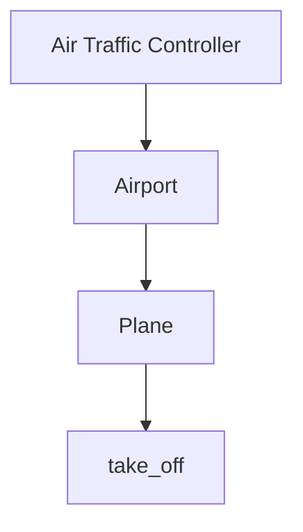
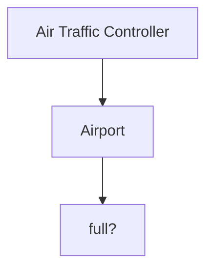
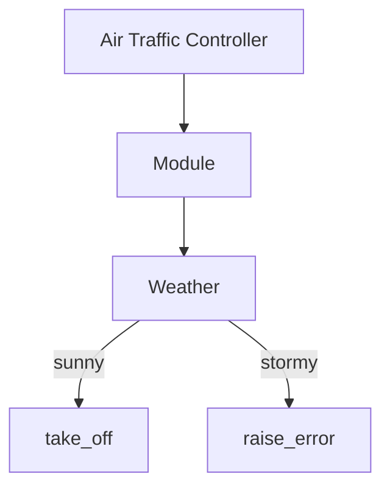
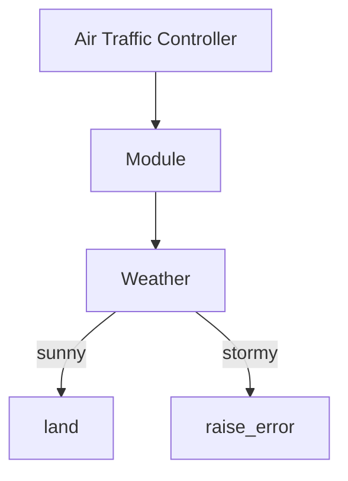

### Airport Challenge
=================

```
        ______
        _\____\___
=  = ==(____MA____)
          \_____\___________________,-~~~~~~~`-.._
          /     o o o o o o o o o o o o o o o o  |\_
          `~-.__       __..----..__                  )
                `---~~\___________/------------`````
                =  ===(_________)

```

## Task

We have a request from a client to write the software to control the flow of planes at an airport. The planes can land and take off provided that the weather is sunny. Occasionally it may be stormy, in which case no planes can land or take off.

I approached this challenge by using a test driven approach:

1) Create a domain model and diagram from the user story
2) Feature test the the user story via irb
3) Create a failing test (red) in rspec
4) Develop code to result in a passing test (green) in rspec
5) Refactor the code and re-test in rspec (orange)
6) Feature test the code in irb
7) Once I have 1) high coverage, 2) passing rspec tests, 3) code that fulfills the user story. I will progress to the next user story and repeat steps 1-7

## Getting started

1) git clone path-to-repo
2) Install bundler via `gem install bundle` (if you don't have bundler already)
3) Install dependencies via `bundle`


## Test Code

Run rspec from the main directory to test the code and check coverage

## Run

Run code using irb

`require './lib/airport'`
`require './lib/plane'`

## User Stories, Domain Models and Mermaid Diagrams

`As an air traffic controller 
So I can get passengers to a destination 
I want to instruct a plane to land at an airport`

|  Objects        |  Messages      |
| ----------      | -------------  | 
| Air Traffic Controller  |          |
| Plane           | land           |
| Airport         | store_plane()  |

```mermaid
graph TD
    A[Air Traffic Controller] -->B[Plane]
    B[Plane] -->C[land]
    C[land] --> D[Airport]
    D[Airport] -->E[store_plane(arg)]
```


`As an air traffic controller 
So I can get passengers on the way to their destination 
I want to instruct a plane to take off from an airport and confirm that it is no longer in the airport`

|  Objects        |  Messages      |
| ----------      | -------------  | 
| Air Traffic Controller  |          |
| Airport         |                |
| Plane           | take_off       |




`As an air traffic controller 
To ensure safety 
I want to prevent landing when the airport is full`

|  Objects        |  Messages      |
| ----------      | -------------  | 
| Air Traffic Controller  |          |
| Airport         | full?          |
| Plane           |                |




`As the system designer
So that the software can be used for many different airports
I would like a default airport capacity that can be overridden as appropriate`

|  Objects        |  Messages      |
| ----------      | -------------  | 
| Air Traffic Controller  |          |
| Airport         | Airport.new(5) |
| Plane           |                |

```mermaid
graph TD
    A[Air Traffic Controller] -->B[Airport]
    B[Airport] --> C[Airport.new(10)]
    C[Airport.new(5)] --> D[capacity = 10]
```


`As an air traffic controller 
To ensure safety 
I want to prevent takeoff when weather is stormy`

|  Objects        |  Messages      |
| ----------      | -------------  | 
| Air Traffic Controller |         |
| Main            |     weather    |
| Airport         |                |
| Plane           |  take_off      |


    

`As an air traffic controller 
To ensure safety 
I want to prevent landing when weather is stormy` 

|  Objects        |  Messages      |
| ----------      | -------------  | 
| Air Traffic Controller |         |
| Main            |     weather    |
| Airport         |                |
| Plane           |  land      |

