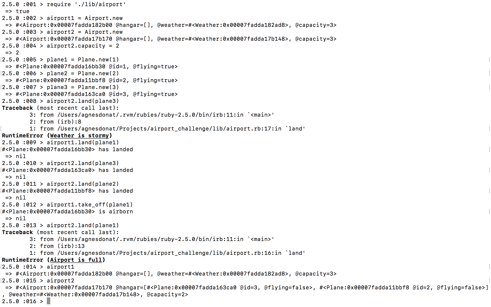

Airport Challenge
=================

```
        ______
        _\____\___
=  = ==(____MA____)
          \_____\___________________,-~~~~~~~`-.._
          /     o o o o o o o o o o o o o o o o  |\_
          `~-.__       __..----..__                  )
                `---~~\___________/------------`````
                =  ===(_________)

```

My approach
---------
I was very excited to revisit this challenge as the weekend we were supposed to finish it, I could not implement the weather condition and my code did not defend against the edge cases. While my first attempt was relying on our Boris Bike challenge from week one, this time I was more confident to experiment more and trust my knowledge. In addition, it was a fantastic opportunity to solidify my understanding of concepts (delegation, dependency injection, test doubles, method stubs). I also managed to achieve 100% test coverage, while last time it was only 91%.
It is likely that the code needs even more refactoring, and I am not entirely sure if the Single Responsibility Principle was properly followed in my land and take-off methods of the Airport class.

Task
-----
We have a request from a client to write the software to control the flow of planes at an airport. The planes can land and take off provided that the weather is sunny. Occasionally it may be stormy, in which case no planes can land or take off.  Here are the user stories that we worked out in collaboration with the client:

```
As an air traffic controller
So I can get passengers to a destination
I want to instruct a plane to land at an airport

As an air traffic controller
So I can get passengers on the way to their destination
I want to instruct a plane to take off from an airport and confirm that it is no longer in the airport

As an air traffic controller
To ensure safety
I want to prevent takeoff when weather is stormy

As an air traffic controller
To ensure safety
I want to prevent landing when weather is stormy

As an air traffic controller
To ensure safety
I want to prevent landing when the airport is full

As the system designer
So that the software can be used for many different airports
I would like a default airport capacity that can be overridden as appropriate
```
How to install and run code
-----
* Clone Repository
* Open Command Line
* cd to Directory
* run bundle
* run rspec to see Test Coverage
* run IRB
* require './lib/airport.rb'
* Create a new airport: airport = Airport.new
* Create a new plane: plane = Plane.new('id')
* To land plane: airport.land(plane)
* To take_off plane: airport.take_off(plane)
* To change airport capacity: airport.capacity = 5
* Weather is randomised, if it is stormy planes won't land or take take_off
* The program will warn us if a plane tries landing at an already full airport

Sample
-----

