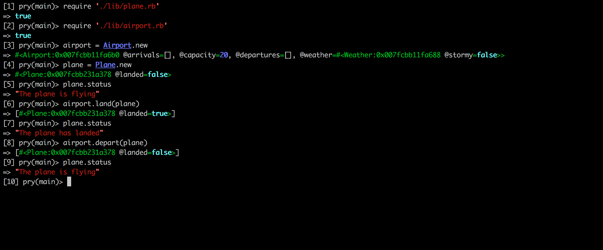
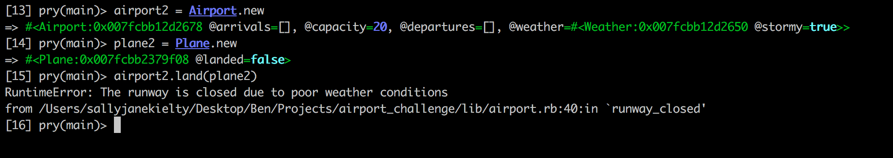
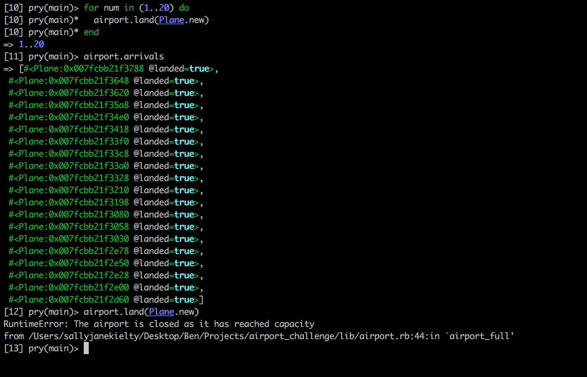

### Airport Challenge


```
        ______
        _\____\___
=  = ==(____MA____)
          \_____\___________________,-~~~~~~~`-.._
          /     o o o o o o o o o o o o o o o o  |\_
          `~-.__       __..----..__                  )
                `---~~\___________/-----------------)
                =  ===(_________)

```

I have been asked to write the software to control the flow of planes at an airport.

Planes can land and take off provided that the weather is sunny. Occasionally it may be stormy, in which case no planes can land or take off.

## User Stories

```
As an air traffic controller
So I can get passengers to a destination
I want to instruct a plane to land at an airport and confirm that it has landed

As an air traffic controller
So I can get passengers on the way to their destination
I want to instruct a plane to take off from an airport and confirm that it is no longer in the airport

As an air traffic controller
To ensure safety
I want to prevent takeoff when weather is stormy

As an air traffic controller
To ensure safety
I want to prevent landing when weather is stormy

As an air traffic controller
To ensure safety
I want to prevent landing when the airport is full

As the system designer
So that the software can be used for many different airports
I would like a default airport capacity that can be overridden as appropriate
```

## Technology

I have used Ruby version 2.3.3 in order to create the project and Rspec in order to test my code.

## Installation

Follow the following steps in order to run this project:

* Fork or clone the project from Github

* $ bundle install

There is no front end user interface in this program and it should therefore be run in irb or pry.  

##Using the Software

To use the software, enter irb and require 'airport.rb' and 'plane.rb'.  The screenshots below show examples of users creating instances of Airport and Plane classes.

The below screenshot shows the status of an instance of Plane, before and after it has landed at an instance of Airport.  The screenshot also shows the plane departing from the airport and confirms that it has taken-off when the #status method is subsequently called.



The screenshot below shows a user attempting to land a plane when the weather at the airport is stormy.  The weather is set when the airport is initialised.



The screenshot below shows an example of a Runtime error which is generated when the user attempts to land a plane when the airport is already at capacity.  By default, that capacity is set at 20 planes, however this can be amended by passing a number as a parameter when the Airport class is initialised.




## Tests

To run the tests, run the following command:

* rspec

##Future Enhancements

In order to improve the application further, a front-end user interface could be created to improve the user experience.
