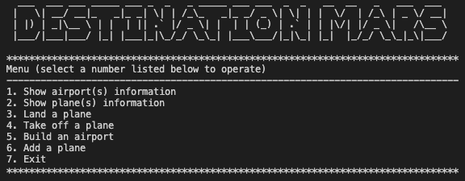

# Destination Mars

*A command line app to manage air traffic in Mars*

#### Functions

1. **Show airport(s) information**: all airports in Mars
2. **Show plane(s) information**: all planes in Mars
3. **Land a plane**: select a plane and an airport to land
4. **Take off a plane**: select a plane to take off
5. **Build an extra airport**
6. **Add a plane**

#### How to use

1. [Setup](docs/setup.md)
2. run "ruby destination_mars.rb" in command line. Innitially, it starts with 1 airport and 15 planes
3. follow menu

[Domain Model](domain_model.md)