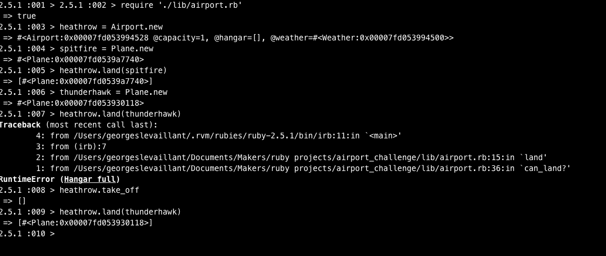

# Airport Challenge

Program for control of flow of planes through an airport, depending on whether weather is stormy or clear as gnenerated by random

## Getting Started

Clone or download this Repo.

then load into IRB

```
irb
```
in the terminal.

Once in the irb repl
use as per image:



### Prerequisites

```
Terminal, ruby, §

,  git
```

### Approach

I approached this in the same manner as the boris bikes challenge earlier this week due to their similarity in the need to both store, intake and outtake objects. I dove into testing first, starting simply and working my way up until the code presented here grew from the testing methods. The major logic is in testing the result of the return of each test to see if it it matches the change in data we expected and asserted in our tests. Via research and advice from peers I began to follow an Arrange - Act - Assert methodology to my tests and found it decidedly increased my test understanding and output.

### Work still to be done

Ideally I would test this code on its ability to store individual instances of planes so that the take_off method would take an individual plane as an argument and have that precise plane leave the hangar. Further I would like to test the code at dealing with multiple requests at once and how far the hangar control methods can work. It would also be interesting to me to test other weather conditions to see how they would affect the codes growth over time.

#### Refactoring to be done Code

- Moving the land method from the airport to the plane, allowing for the growth of the planes as individual    objects.
- The land method could be reduced to two methods, one for deciding if the weather is clear or not, and one to control the flow of the plane as directed by the output of that method.
-  The take_off method could also be reduced in the same way allowing it to simply control flow of planes.

#### Refactoring to be done tests
- The tests using doubles and mocks I feel could be made more eloquent. For now I feel they are easily readable but could be maintain that readability to be made simpler through more research.
- I consider removing all let variables, as sometimes I feel like they do not make things easier to read, as discovered when my tests were peer reviewed and the AAA method above was introduced.
- Further research is required to see if the second/sub describe block is necessary? It was based off of a similar test conducted previously by myself and while works for this scenario it could be made better.

## Authors


* **Georges Le Vaillant** - [GLV](https://github.com/stonefarmer9)


## Acknowledgments

* Makers Academy
