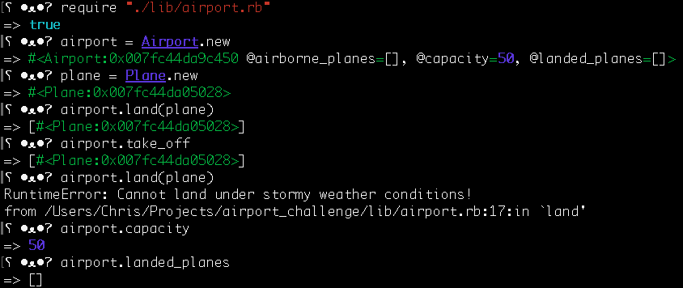

Airport Challenge
=================

```
        ______
        _\____\___
=  = ==(____MA____)
          \_____\___________________,-~~~~~~~`-.._
          /     o o o o o o o o o o o o o o o o  |\_
          `~-.__       __..----..__                  )
                `---~~\___________/------------`````
                =  ===(_________)

```

What is it?
---------
A fully functional Airport model at which planes can land and take off complete with randomised weather restrictions.

Instructions
---------
1. Clone this repo
2. if you don't have bundler, run the command 'gem install bundler'
3. run 'bundle'
4. open a REPL, and follow the example below


My approach
-------
At the time of writing this code I am half way through Sandi Mets' 'Practical Object Oriented Design In Ruby' and I have only been test driving my development for five days. As a result my main objective in this task is to get a high test coverage and implement as many of the POODIR teachings as possible.

Retrospective
-------
I am writing this section 5 weeks after the last time I looked at this project. Looking back at this project has been very eye opening, 5 weeks ago I was proud of this code, I was happy with how it looked and at the time I couldn't see how it could get any better. 5 weeks later I can see that I obviously didn't fully understand instance variables and attribute readers/writers at the time of writing this, my understanding of POODIR was not as good as I thought at the time as my dependency injection is messy and long winded and the code itself is no where close to as readable as I had previously thought. However, I am now very curious as to how I will view this code in another 5 weeks, or even a year from now.

Original specification
-----

We have a request from a client to write the software to control the flow of planes at an airport. The planes can land and take off provided that the weather is sunny. Occasionally it may be stormy, in which case no planes can land or take off.  Here are the user stories that we worked out in collaboration with the client:

```
As an air traffic controller
So I can get passengers to a destination
I want to instruct a plane to land at an airport and confirm that it has landed

As an air traffic controller
So I can get passengers on the way to their destination
I want to instruct a plane to take off from an airport and confirm that it is no longer in the airport

As an air traffic controller
To ensure safety
I want to prevent takeoff when weather is stormy

As an air traffic controller
To ensure safety
I want to prevent landing when weather is stormy

As an air traffic controller
To ensure safety
I want to prevent landing when the airport is full

As the system designer
So that the software can be used for many different airports
I would like a default airport capacity that can be overridden as appropriate
```

Your task is to test drive the creation of a set of classes/modules to satisfy all the above user stories. You will need to use a random number generator to set the weather (it is normally sunny but on rare occasions it may be stormy). In your tests, you'll need to use a stub to override random weather to ensure consistent test behaviour.

Your code should defend against [edge cases](http://programmers.stackexchange.com/questions/125587/what-are-the-difference-between-an-edge-case-a-corner-case-a-base-case-and-a-b) such as inconsistent states of the system ensuring that planes can only take off from airports they are in; planes that are already flying cannot takes off and/or be in an airport; planes that are landed cannot land again and must be in an airport, etc.

For overriding random weather behaviour, please read the documentation to learn how to use test doubles: https://www.relishapp.com/rspec/rspec-mocks/docs . There’s an example of using a test double to test a die that’s relevant to testing random weather in the test.

Please create separate files for every class, module and test suite.

In code review we'll be hoping to see:

* All tests passing
* High [Test coverage](https://github.com/makersacademy/course/blob/master/pills/test_coverage.md) (>95% is good)
* The code is elegant: every class has a clear responsibility, methods are short etc.

Reviewers will potentially be using this [code review rubric](docs/review.md).  Referring to this rubric in advance will make the challenge somewhat easier.  You should be the judge of how much challenge you want this weekend.

**BONUS**

* Write an RSpec **feature** test that lands and takes off a number of planes

Note that is a practice 'tech test' of the kinds that employers use to screen developer applicants.  More detailed submission requirements/guidelines are in [CONTRIBUTING.md](CONTRIBUTING.md)

Finally, don’t overcomplicate things. This task isn’t as hard as it may seem at first.

* **Submit a pull request early.**  There are various checks that happen automatically when you send a pull request.  **Fix these issues if you can**.  Green is good.

* Finally, please submit a pull request before Monday at 9am with your solution or partial solution.  However much or little amount of code you wrote please please please submit a pull request before Monday at 9am.
