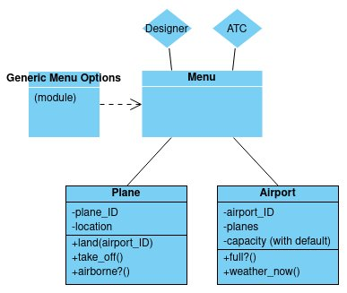

Airport Challenge
=================

```
        ______
        _\____\___
=  = ==(____MA____)
          \_____\___________________,-~~~~~~~`-.._
          /     o o o o o o o o o o o o o o o o  |\_
          `~-.__       __..----..__                  )
                `---~~\___________/------------`````
                =  ===(_________)

```

Task
-----

To write the software to control the flow of planes at an airport. The planes can land and take off provided that the weather is sunny. Occasionally it may be stormy, in which case no planes can land or take off.  Here are the user stories:

```
1. As an air traffic controller 
So I can get passengers to a destination 
I want to instruct a plane to land at an airport

2. As an air traffic controller 
So I can get passengers on the way to their destination 
I want to instruct a plane to take off from an airport and confirm that it is no longer in the airport

3. As an air traffic controller 
To ensure safety 
I want to prevent landing when the airport is full 

4. As the system designer
So that the software can be used for many different airports
I would like a default airport capacity that can be overridden as appropriate

5. As an air traffic controller 
To ensure safety 
I want to prevent takeoff when weather is stormy 

6. As an air traffic controller 
To ensure safety 
I want to prevent landing when weather is stormy 
```

My approach
-----

My first step was to represent the objects and messages that I'd need to meet these user stories. First I represented it in a table:

| User story | Object | Messages
| -----------|--------|---------
|As an air traffic controller, So I can get passengers to a destination, I want to instruct a plane to land at an airport | Air traffic controller|
||Plane | land
| | Airport | 
|As an air traffic controller, So I can get passengers on the way to their destination, I want to instruct a plane to take off from an airport and confirm that it is no longer in the airport | (Plane) | take_off, check_location
|As an air traffic controller, To ensure safety, I want to prevent landing when the airport is full |(Airport)| full?
| As the system designer, So that the software can be used for many different airports, I would like a default airport capacity that can be overridden as appropriate| System designer |
||(Airport) | initialize (with default and overrride for capacity)
|As an air traffic controller, To ensure safety, I want to prevent takeoff when weather is stormy| (Airport) | weather_now
|As an air traffic controller, To ensure safety, I want to prevent landing when weather is stormy| (Airport) | (weather_now)
</br>

In addition, whilst not a user story, I thought it prudent to have unique identifiers for each plane and airport, so that handling interactions would be easier from a human point of view (i.e. not having to deal directly with object instance references). For this reason, I thought it would be helpful for each plane object to have a `plane_ID` and each airport to have an `airport_ID`. I decided broadly to follow existing international conventions for this, so determined when I started coding that they would follow this format:

Attribute| Format | Example
---|---|---
plane_ID | "Tail number" | G-EBBT for a de Havilland DH.34 registered in 1922
airport_ID | IATA airport code (trigram) | LBA for Leeds–Bradford (Airport)
</br>

Finally, I did not want all methods/classes to be equally open to view and edit for all users, as the user stories were so different. So again, whilst not a user story per se, I decided to implement a command-line based menu system, which would give different options depending on what sort of user was using the system. If this were to come up in a professional setting, I would of course not go around inventing new user stories like this, but I felt it was the sort of thing I might have persuaded the system designer and air traffic controller was a good idea...!

Taken together, this led me to an initial three-class domain model:


</br></br>
Additional guidance in the original brief
-----
Your task is to test drive the creation of a set of classes/modules to satisfy all the above user stories. You will need to use a random number generator to set the weather (it is normally sunny but on rare occasions it may be stormy). In your tests, you'll need to use a stub to override random weather to ensure consistent test behaviour.

Your code should defend against [edge cases](http://programmers.stackexchange.com/questions/125587/what-are-the-difference-between-an-edge-case-a-corner-case-a-base-case-and-a-b) such as inconsistent states of the system ensuring that planes can only take off from airports they are in; planes that are already flying cannot take off and/or be in an airport; planes that are landed cannot land again and must be in an airport, etc.

For overriding random weather behaviour, please read the documentation to learn how to use test doubles: https://www.relishapp.com/rspec/rspec-mocks/docs . There’s an example of using a test double to test a die that’s relevant to testing random weather in the test.

Please create separate files for every class, module and test suite.

In code review we'll be hoping to see:

* All tests passing
* High [Test coverage](https://github.com/makersacademy/course/blob/master/pills/test_coverage.md) (>95% is good)
* The code is elegant: every class has a clear responsibility, methods are short etc. 

Reviewers will potentially be using this [code review rubric](docs/review.md).  Referring to this rubric in advance will make the challenge somewhat easier.  You should be the judge of how much challenge you want this at this moment.

**BONUS**

* Write an RSpec **feature** test that lands and takes off a number of planes

Note that is a practice 'tech test' of the kinds that employers use to screen developer applicants.  More detailed submission requirements/guidelines are in [CONTRIBUTING.md](CONTRIBUTING.md)

Finally, don’t overcomplicate things. This task isn’t as hard as it may seem at first.

* **Submit a pull request early.**

* Finally, please submit a pull request before Monday at 9am with your solution or partial solution.  However much or little amount of code you wrote please please please submit a pull request before Monday at 9am.
