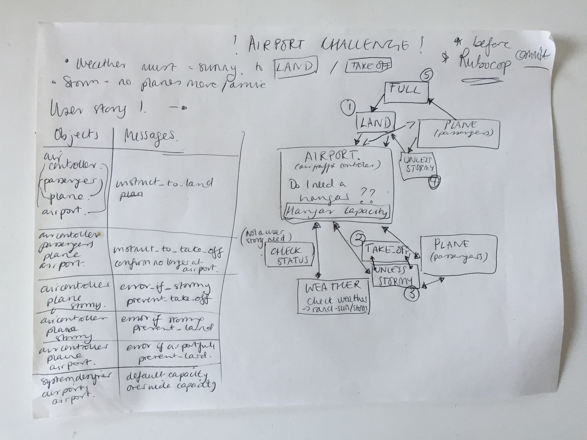

Airport Challenge - Solution
============================

Working with a set of 6 user stories to write test driven  software for the control of planes at an airport. Requirements are based on planes only being able to land and take off when the weather is sunny.

### Approach to solving the challenge:
Starting with each user story, I have drawn out the objects and the behaviour that is relevant to building the feature and create a domain model on pen and paper:



From the domain model, I have written a feature.rb file to write the desired software behaviour as a feature test - writing the lines of code that I envisage solving this particular issue for the user story.

Once I've received the predicted our come I took the lines of feature test code and reworked into a Rspec unit test.

Then use the red, green, refactor process to iterate on the tests and build the code base. Working to have 100% test coverage and all tests passing.

Avoiding using the 'subject' in class under test as feel it gives an element of code smell working with a long list of tests.

### Status at point of push:
Used .sample to calculate the weather with a higher degree of sunny to stormy. Did not have time to refactor the code to use .rand.
Would also have liked to investigate edge cases a little further.

### Description of what code does:

### Build Status:
All tests passing with 100% coverage.
No Rubocop issues.

### Code Style:
Standard. Ran Rubocop before each commit it avoid recording any style errors.

### Tech/Framework used
Built in Ruby with Rspec test driven development.

### Features:
The system engineer can set the capacity of each airport instance.

### How to install the code:
Close this repo.
Innit Rspec.

### How to use the code:
Run ```bundle```.

### How to run the tests:
Tests are broken out by class under test and are to be run with Rspec.

### Contribute:
Fork this repo and make a copy. Pull requests with updates are welcome.

### Credits:
This challenge was developed by Makers Academy for week one of the 12 week bootcamp course.
